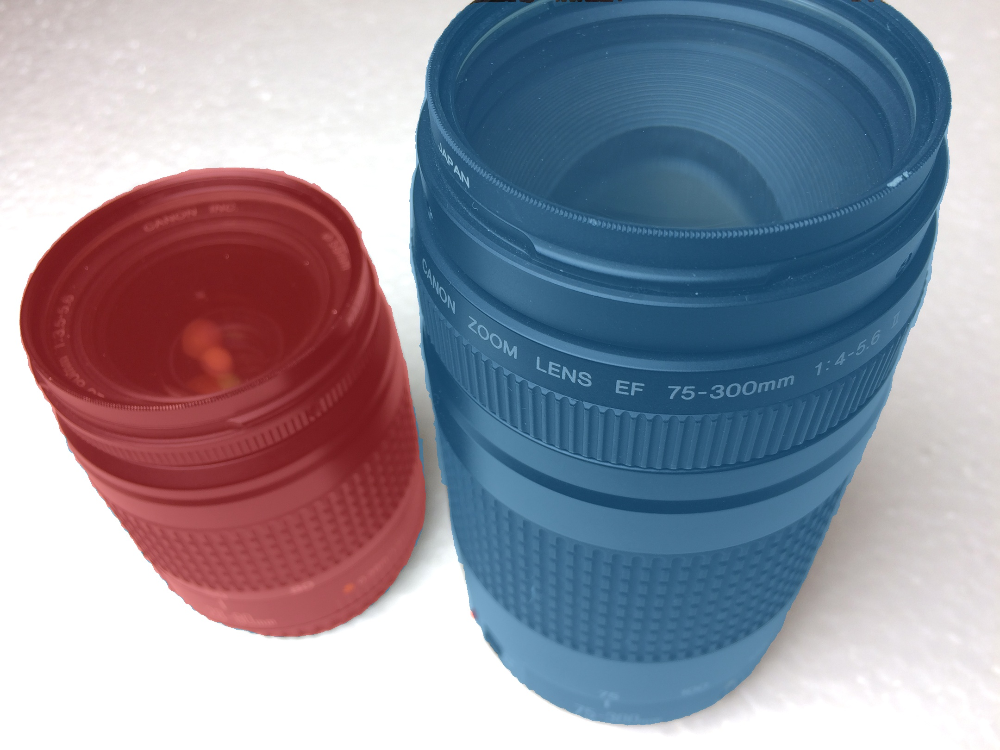

# LISA++
## Chat:
```
CUDA_VISIBLE_DEVICES=0 python chat_instance.py --version='Senqiao/LISA_Plus_7b' --precision='bf16'
```

## Example
<table class="center">
<tr>
  <td style="text-align:center;"><b>Input</b></td>
  <td style="text-align:center;"><b>Output</b></td>
</tr>

<tr>
  <td></td>
  <td></td>
</tr>
<tr>
<td width="50%" style="text-align:center;color:gray;">
  Please describe the two cameras.
  <span style="font-weight: bold; color: #4b8b3b;">+ DEFAULT_INST_CONV_SEG</span>
</td>
  <td width=50% style="text-align:center;">" The image depicts two vibrant camera models resting on a surface. The larger of the two[ [SEG] ] is situated towards the front of the image, characterized by its prominent lens and sturdy build, indicating it could be a D- sl or E- within the camera brand lineup. The other[ [SEG] ], smaller in size, also a camera, is located further back in the image and is partially obscured by the larger one, characterized by its smaller lens and less prominent features. Both are placed on a surface suggesting they might be on display or in use."</td>
</tr>
<tr>
  <td></td>
  <td></td>
</tr>
<tr>
<td width="50%" style="text-align:center;color:gray;">
  Please describe the two cameras.
  <span style="font-weight: bold; color: #FF7F50;">+ DEFAULT_INSTANT_SEG</span>
</td>
  <td width=50% style="text-align:center;">" Sure, [SEG] , [SEG] , [SEG] , and [SEG] ."</td>
</tr>
</table>

